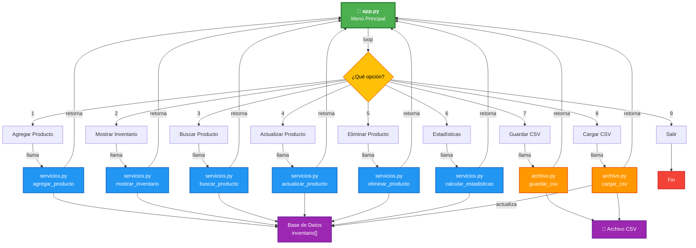

# 📦 Sistema de Gestión de Inventario

Aplicación en Python para gestionar inventarios de productos con funcionalidades de almacenamiento en CSV.

---

## 🐍 Instalación de Python

### Windows
1. Descarga Python desde [python.org](https://www.python.org/downloads/)
2. Ejecuta el instalador y **marca la casilla "Add Python to PATH"**
3. Haz clic en "Install Now"
4. Verifica la instalación abriendo una terminal y escribiendo:
   ```bash
   python --version
   ```

### macOS / Linux
Abre una terminal y ejecuta:
```bash
# macOS (con Homebrew)
brew install python3

# Linux (Debian/Ubuntu)
sudo apt-get install python3
```

Verifica con:
```bash
python3 --version
```

---

## 📋 Descripción de Archivos

### **app.py** - Aplicación Principal
Interfaz de menú interactivo que gestiona el inventario con las siguientes opciones:
- ✅ Agregar productos (con validación de nombre, precio y cantidad)
- ✅ Mostrar inventario completo
- ✅ Buscar productos por nombre
- ✅ Actualizar precio y cantidad de productos
- ✅ Eliminar productos
- ✅ Ver estadísticas del inventario
- ✅ Guardar/Cargar inventarios desde archivos CSV

### **archivo.py** - Gestión de Archivos CSV
Módulo para importar y exportar datos:
- `guardar_csv()`: Guarda el inventario en un archivo CSV con encabezados
- `cargar_csv()`: Carga productos desde un CSV con validación de datos
- Maneja errores de permisos, codificación y formato inválido

### **servicios.py** - Funciones del Negocio
Contiene las operaciones principales del inventario:
- `agregar_producto()`: Añade nuevos productos
- `mostrar_inventario()`: Muestra todos los productos en formato tabla
- `buscar_producto()`: Busca por nombre (case-insensitive)
- `actualizar_producto()`: Modifica precio y/o cantidad
- `eliminar_producto()`: Remueve productos
- `calcular_estadisticas()`: Genera reportes de valor total y productos destacados

---

## � Diagrama de Flujo



---

## �🚀 Cómo Usar

1. Abre una terminal en la carpeta del proyecto
2. Ejecuta:
   ```bash
   python app.py
   ```
3. Selecciona una opción del menú (1-9)
4. Sigue las instrucciones en pantalla

---

## 📝 Notas
- Los productos se validan antes de ser agregados
- Los archivos CSV deben tener el formato: `nombre,precio,cantidad`
- Las operaciones incluyen manejo de errores para entradas inválidas
